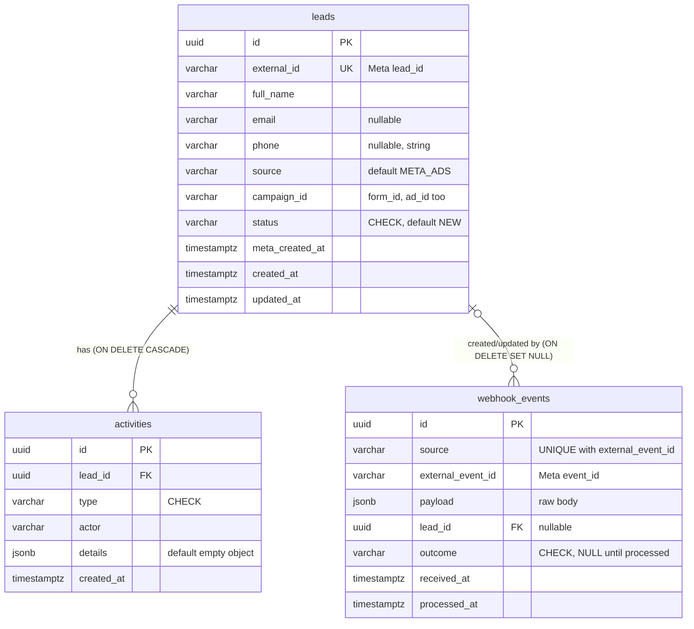
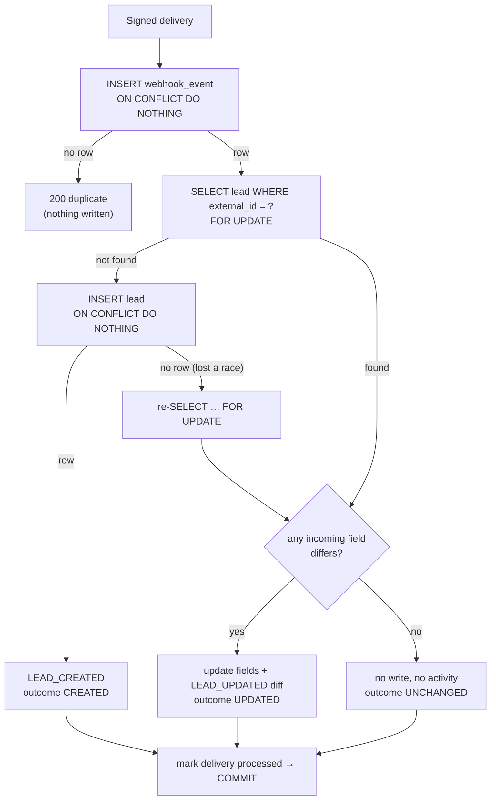
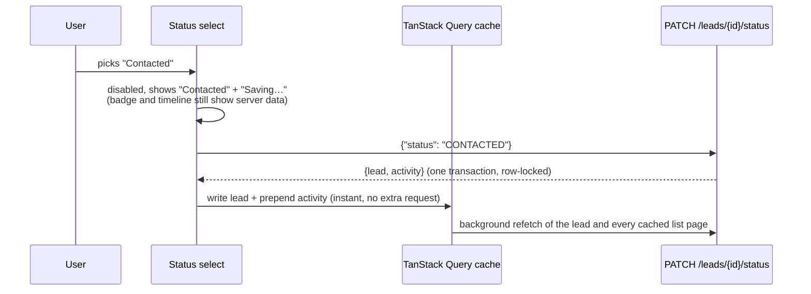

# Stylework Lead Intake Service

Receives Meta Ads leads via webhook, stores them with an append-only audit trail, and displays them
in a React dashboard.

> **Work in progress.** Full architecture, deployment, trade-offs and scaling documentation will be
> added as the build progresses. Design decisions and AI usage are recorded in [AGENT.md](AGENT.md).

## Stack

| Layer | Choice |
|---|---|
| Backend | Python 3.12, FastAPI, Pydantic v2 (uv for packaging) |
| Database | PostgreSQL 17, SQLAlchemy 2.x (sync) + psycopg 3, Alembic migrations |
| Frontend | React + TypeScript (Vite) |
| Deployment | Docker, Railway *(upcoming)* |
| CI | GitHub Actions: ruff + pytest against a Postgres service (backend), oxlint + type-check + build (frontend) |

## Repository layout

```
backend/
  app/
    api/          routes and dependencies (per-request DB session)
    core/         settings, JSON logging, request-ID middleware
    db/           engine/session factory, declarative Base
    models/       SQLAlchemy models: leads, activities, webhook_events
    schemas/      Pydantic response models
  alembic/        database migrations
  scripts/        seed.py (demo data), send_test_webhook.py, init-test-db.sql
  tests/
    unit/         no database needed
    integration/  run against real PostgreSQL
frontend/src/
  main.tsx        QueryClientProvider + RouterProvider
  router.tsx      routes (react-router v8, data mode)
  api/            typed fetch client (ApiError), backend types, endpoint functions
  hooks/          TanStack Query hooks (useLeads), useNow for live relative times
  components/     layout, table, status badge, loading / empty / error states
  pages/          one component per route
  lib/            query client (retry policy), constants, Intl date formatting
docker-compose.yml  local PostgreSQL
.github/          CI workflow
AGENT.md          AI usage, architecture decisions, contribution log
```

## Data model



- **`leads`**: one row per Meta lead. `external_id` (Meta's `lead_id`) is `UNIQUE`: it is the
  lead's identity, so the same lead can never be stored twice.
- **`activities`**: the audit trail (`LEAD_CREATED`, `LEAD_UPDATED`, `STATUS_CHANGED`), append-only:
  no code path updates or deletes an activity. `details` holds type-specific JSON (status
  from/to, field-level diff, webhook event ids); `actor` records who caused it.
- **`webhook_events`**: one row per accepted delivery. `UNIQUE (source, external_event_id)` is the
  idempotency guard: a redelivered event cannot be inserted twice, even when two deliveries race.
  The raw payload is kept for audit/replay and is never returned by the API or logged.

**Enums as VARCHAR + CHECK**, not native Postgres `ENUM`: adding a value to a native enum needs
special migration handling; a CHECK is a plain drop-and-recreate. The CHECK SQL is generated from
the Python `StrEnum`s, so code and database cannot drift.

**Delete rules:** deleting a lead (e.g. an erasure request) cascades to its activities, which mean
nothing without it, but only nulls `webhook_events.lead_id`, so the fact that a delivery was received
survives.

**Indexes**, each tied to a query:

| Index | Serves |
|---|---|
| `ix_leads_status_created_at (status, created_at DESC)` | Lead list filtered by status, newest first |
| `ix_leads_created_at (created_at DESC)` | Unfiltered lead list, newest first |
| `ix_activities_lead_id_created_at (lead_id, created_at DESC)` | Activity timeline of one lead (also covers the FK, which Postgres does not index automatically) |
| `uq_leads_external_id` | Webhook lookup of an existing lead by Meta `lead_id` |
| `uq_webhook_events_source_external_event_id` | Duplicate-delivery detection |

Deliberately not indexed yet: `webhook_events.lead_id` (no query reads deliveries by lead) and the
lead search columns. Search uses `ILIKE` on name/email/phone, fine at this scale; a `pg_trgm` GIN
index is the scaling path.

Constraint and index names follow a naming convention set on the SQLAlchemy `MetaData`, so
migrations can reference them predictably.

## API

Interactive docs: `http://localhost:8000/docs` (the bare `/` redirects there; OpenAPI at
`/openapi.json`), with example requests and responses for the webhook, the status update and the
error envelope. JSON is camelCase.

| Method | Path | Purpose |
|---|---|---|
| `GET` | `/health` | Liveness + database check (503 if Postgres is unreachable) |
| `GET` | `/leads` | Paginated, filterable, searchable lead list |
| `GET` | `/leads/{id}` | One lead with its activity timeline |
| `PATCH` | `/leads/{id}/status` | Change status; records a `STATUS_CHANGED` activity |
| `GET` | `/webhook/meta-lead` | Meta subscription handshake |
| `POST` | `/webhook/meta-lead` | Signed Meta lead ingestion (see [Webhook](#webhook-post-webhookmeta-lead)) |

### `GET /leads`

| Param | Default | Rules |
|---|---|---|
| `page` | 1 | ≥ 1. A page past the end returns an empty `data` list with correct totals. |
| `limit` | 20 | 1–100 |
| `status` | – | `NEW`, `CONTACTED`, `QUALIFIED`, `CONVERTED` or `LOST` |
| `search` | – | ≤ 100 chars, trimmed. Case-insensitive substring of name, email or phone; `%` and `_` match literally. |

Ordered newest first (`created_at DESC, id DESC`; the id tie-break keeps page boundaries stable).

```json
{
  "data": [
    {"id": "…", "fullName": "Rahul Sharma", "email": "rahul@example.com", "phone": "+919999999999",
     "status": "NEW", "source": "META_ADS", "campaignId": "cmp_1", "createdAt": "2026-09-25T10:00:00Z"}
  ],
  "pagination": {"page": 1, "limit": 20, "total": 1, "totalPages": 1}
}
```

### `GET /leads/{id}`

```json
{
  "lead": {"id": "…", "externalId": "meta_lead_123", "fullName": "Rahul Sharma", "…": "…",
           "formId": "form_1", "adId": "ad_1", "metaCreatedAt": "…", "updatedAt": "…"},
  "activities": [
    {"id": "…", "type": "STATUS_CHANGED", "actor": "user:dashboard",
     "details": {"from": "NEW", "to": "CONTACTED"}, "createdAt": "…"},
    {"id": "…", "type": "LEAD_CREATED", "actor": "system:meta_webhook", "details": {"…": "…"}, "createdAt": "…"}
  ]
}
```

Activities are newest first. The raw webhook payload is never exposed.

### `PATCH /leads/{id}/status`

Request `{"status": "CONTACTED"}` → `{"lead": {…}, "activity": {…}}`. Any status may move to any
other. Setting the status the lead already has is a **no-op**: nothing is written and
`"activity": null`, keeping the audit trail free of noise.

How it stays consistent, all in **one transaction**:

1. `SELECT … FOR UPDATE` locks the lead's row. A concurrent update of the same lead waits here, so
   the `from` value recorded next is always the status actually being replaced.
2. Same status → return without writing.
3. `UPDATE` the status and `INSERT` the `STATUS_CHANGED` activity (`{"from", "to"}`).
4. `COMMIT`. If either write fails, both roll back: a lead and its audit trail never disagree.

Activity timestamps use `clock_timestamp()` (time of insert, after the lock is held) rather than
`now()` (transaction start), so the timeline shows concurrent changes in the order they happened.

### Errors

Every non-2xx response has the same envelope:

```json
{"error": {"code": "LEAD_NOT_FOUND", "message": "Lead not found", "details": null, "requestId": "3f2a…"}}
```

| Status | Code | When |
|---|---|---|
| 422 | `VALIDATION_ERROR` | Invalid query/path/body; `details` lists `{location, field, message}` per problem (the rejected value is not echoed) |
| 404 | `LEAD_NOT_FOUND` | Unknown lead id |
| 404 | `NOT_FOUND` | Unknown route |
| 405 | `METHOD_NOT_ALLOWED` | Wrong method (with `Allow` header) |
| 500 | `INTERNAL_ERROR` | Unexpected failure; traceback is logged under the `requestId`, never returned |

`requestId` matches the `X-Request-ID` response header and the server log lines for that request.

## Webhook: `POST /webhook/meta-lead`

### Payload

A normalized, flat payload (snake_case, as Meta sends field names):

```json
{
  "event_id": "evt_123",
  "lead_id": "meta_lead_123",
  "created_time": "2026-09-24T10:00:00+0000",
  "campaign_id": "cmp_1", "form_id": "form_1", "ad_id": "ad_1",
  "full_name": "Rahul Sharma",
  "email": "rahul@example.com",
  "phone": "+919999999999"
}
```

Required: `event_id`, `lead_id`, `full_name`, and at least one of `email` / `phone`. Values are
trimmed, the email is lowercased and format-checked, blank optional fields become null,
`created_time` must include a timezone, and unknown fields are ignored.

> **Honest scope note.** A real Meta Lead Ads webhook carries only a `leadgen_id` plus page/form/ad
> ids; the name, email and phone are then fetched from the Graph API with a page access token.
> This service accepts the lead *after* that enrichment step. The Graph API fetch is out of scope.

### Authenticity

Meta signs each delivery with HMAC-SHA256 over the **raw body bytes**, keyed with the app secret,
in `X-Hub-Signature-256: sha256=<hex>`. The service reads the raw body (capped at 64 KiB),
recomputes the HMAC and compares in constant time **before parsing anything**, so an
unauthenticated caller gets `401 INVALID_SIGNATURE` and nothing else. An empty
`META_APP_SECRET` rejects every delivery; production refuses to start without it.

`GET /webhook/meta-lead` answers Meta's subscription handshake: with `hub.mode=subscribe` and a
`hub.verify_token` equal to `META_VERIFY_TOKEN`, it echoes `hub.challenge` as plain text; otherwise
403.

### Processing (one transaction)

1. Insert the delivery into `webhook_events` with the raw payload.
2. Insert the lead (status `NEW`).
3. Insert a `LEAD_CREATED` activity (`actor: system:meta_webhook`, details reference the delivery).
4. Mark the delivery `outcome: CREATED`, `processed_at`, linked lead → `COMMIT`.

Response: `200 {"status": "processed", "outcome": "CREATED", "leadId": "…"}`. If any step fails,
everything rolls back, **including the delivery row**, so Meta's retry of the same event is
processed from a clean slate. Logs carry the event id and outcome, never lead data; SQL parameters
are hidden from error messages for the same reason.

*Duplicate deliveries:* the delivery is recorded with `INSERT … ON CONFLICT (source,
external_event_id) DO NOTHING`; if no row is inserted the event was already received, nothing else
is written, and the response is `200 {"status": "duplicate"}` (a 2xx, so Meta stops retrying).
*Repeat events for an existing lead:* the lead row is locked (`SELECT … FOR UPDATE`, the same
lock the dashboard status update takes); fields that differ are updated and a `LEAD_UPDATED`
activity records a field-level diff (outcome `UPDATED`); if nothing differs, nothing is written
(outcome `UNCHANGED`, delivery still recorded). Missing fields never erase stored data, and the
webhook never changes the lead's status.

### Idempotency and concurrency

Two separate keys, for two separate problems:

| Key | Constraint | Protects against |
|---|---|---|
| Meta `event_id` | `UNIQUE (source, external_event_id)` on `webhook_events` | The **same delivery** processed twice (retries) |
| Meta `lead_id` | `UNIQUE (external_id)` on `leads` | The **same lead** stored twice (different events about one lead) |



**Why not "check whether the event exists, then insert"?** Two simultaneous deliveries can both
run the check, both see nothing, and both insert. There is no application-level fix for that
window, so the database's unique constraint is the concurrency boundary: `INSERT … ON CONFLICT
DO NOTHING` either inserts or reports a conflict atomically.

**What happens when two identical deliveries arrive at the same instant:** the second `INSERT`
waits on the unique index until the first transaction ends. If the first commits, the second sees
the conflict and answers `duplicate`; if the first rolls back (it failed), the second inserts and
processes normally, so a failed attempt never blocks the retry. Both behaviours were checked by
holding an uncommitted insert open in `psql`.

**Different events for the same new lead at the same instant:** delivery idempotency does not
apply (the event ids differ). Both may find no lead; only one lead `INSERT` succeeds, the other
waits for its commit, gets no row back, re-reads the lead with `FOR UPDATE` and continues as an
update. Result: one lead, one `LEAD_CREATED`, the rest `LEAD_UPDATED` / `UNCHANGED`.

**Webhook and dashboard on the same lead:** both take the same row lock (`FOR UPDATE`), so they
run one after the other, and each audit entry's "from" value is what it actually replaced. The
webhook never writes `status`, so a salesperson's status change is never undone by a later Meta
event.

**Update semantics** (repeat events for an existing lead):

- Fields that differ are applied and recorded as
  `{"changes": {"phone": {"from": "+911…", "to": "+912…"}}, "externalEventId": …, "webhookEventId": …}`
  (field names as in the API).
- A field that is **absent or blank** in a later event never erases the stored value: events are
  treated as partial updates, not full snapshots.
- Identical data → outcome `UNCHANGED`, no activity, but the delivery is still recorded.

**Known limitation: out-of-order events.** The payload carries no event timestamp or version
(`created_time` is when the *lead* was submitted), so for conflicting updates the **last delivered
event wins**. If Meta delivered event B before an older event A, A's values would be applied last.
Fixing that needs a source-provided event version or timestamp to compare against; it is
documented rather than guessed at.

**How this is tested:** real threads against real PostgreSQL, each scenario repeated: the same
event 5× at once (1 processed, 4 duplicates, no 500s); four different events for one new lead at
once (one lead, one `LEAD_CREATED`, an unbroken `from → to` chain); a dashboard status change
racing a webhook update (both survive). Removing `ON CONFLICT` from either insert, or `FOR UPDATE`
from the webhook's lead lookup, makes these tests fail in every round.

### Sending a test webhook

```bash
cd backend
export META_APP_SECRET=change-me        # must match the server's META_APP_SECRET
uv run python scripts/send_test_webhook.py                          # new random lead
uv run python scripts/send_test_webhook.py --bad-signature          # expect 401
uv run python scripts/send_test_webhook.py --event-id evt_1 --event-id evt_1   # processed, then duplicate
# Same lead, fixed created time, new phone on the second run -> LEAD_UPDATED with a phone diff
uv run python scripts/send_test_webhook.py --lead-id L1 --email r@example.com --created-time 2026-09-24T10:00:00Z --phone +911
uv run python scripts/send_test_webhook.py --lead-id L1 --email r@example.com --created-time 2026-09-24T10:00:00Z --phone +912
uv run python scripts/send_test_webhook.py --url https://<host>/webhook/meta-lead
```

The script signs the body itself (stdlib `hmac`), independently of the app code.

## Local development

### Prerequisites

- [Docker Desktop](https://www.docker.com/products/docker-desktop/) (runs PostgreSQL locally)
- [uv](https://docs.astral.sh/uv/) (installs Python 3.12 automatically)
- Node.js 20.19+ (CI uses Node 24)

### 1. Start PostgreSQL

```bash
docker compose up -d --wait db
```

This starts Postgres 17 on `localhost:5432` with two databases: `lead_intake` (development) and
`lead_intake_test` (used only by pytest, so test runs never touch development data). The test
database is created by `backend/scripts/init-test-db.sql` the first time the volume is initialised;
if you created the volume before that script existed, run `docker compose down -v` once.

### 2. Backend

```bash
cd backend
cp .env.example .env                      # defaults match docker-compose.yml
uv sync
uv run alembic upgrade head               # apply migrations
uv run uvicorn app.main:app --reload      # http://localhost:8000/health, /docs
```

`GET /health` returns `{"status":"ok","database":"ok"}`, or **503** with `"database":"error"` if
Postgres is unreachable (connections time out after 5 s rather than hanging).

### 3. Frontend

```bash
cd frontend
npm install
npm run dev                               # http://localhost:5173
```

`VITE_API_BASE_URL` (see `frontend/.env.example`, default `http://localhost:8000`) is the backend
origin. Vite inlines it at **build** time, so a deployed build must have it set before
`npm run build`.

**How the frontend talks to the API.** Components never call `fetch`: a page uses a hook
(`useLeads`), the hook uses TanStack Query, which calls `api/leads.ts`, which uses the typed
`api/client.ts`. The client turns every failure into one `ApiError` (`status`, `code`, `message`,
`details`, `requestId`), with `NETWORK_ERROR` when the server is unreachable, so the UI can say
*why* something failed and show the request id that finds it in the server logs. Queries retry
only network errors and 5xx (at most twice); a 4xx fails the same way every time, so it is shown
immediately. Each query passes TanStack's `AbortSignal` to `fetch`, so a superseded request is
cancelled and can never overwrite newer data.

**Lead list: the URL is the state.** Search, status and page live in the query string
(`/?search=kumar&status=LOST&page=2`), so any view can be shared or bookmarked and Back works.

| Parameter | Rule |
|---|---|
| `status` | one of the five statuses; missing or unknown → all statuses |
| `page` | integer ≥ 1; missing or invalid → 1; past the last page → corrected to the last page once the total is known |
| `search` | trimmed, ≤ 100 characters; whitespace-only → no search |

Defaults are left out, so every view has one canonical URL (the unfiltered first page is just
`/`), and a hand-edited URL such as `/?status=FOO&page=abc` is cleaned up in place instead of
being sent to the API.

- **Search** updates the input immediately; the URL (and so the request) follows 300 ms after
  typing pauses. Typing and filter changes **replace** the history entry (Back does not step
  through every keystroke) and reset to page 1; **pagination links push** a history entry, so
  Back returns to the previous page. A pending search is cancelled by "Clear filters".
- **While a new page or filter loads,** the current rows stay visible but dimmed ("Updating…"),
  instead of flashing back to a loading state.
- **States:** skeleton on first load; "No leads yet" (empty database) vs "No leads match these
  filters" with **Clear filters**; errors show the reason, the request id and **Try again**.
- **Responsive:** a table from the `md` breakpoint (fixed column widths, so columns do not jump
  between pages), stacked cards below it; on phones, pagination is Prev / "x of y" / Next.
- **Accessible:** real `<table>` with header cells; each lead is a real link (the whole row is
  clickable through it); labelled search and status inputs; visible focus rings; the result count
  is announced via a live region; status is shown as text, colour only supplements it.

**Lead detail (`/leads/:id`).** Name, status and creation time; contact details (`mailto:` /
`tel:` links), campaign / form / ad and the time the lead was submitted on Meta; reference ids
(Meta lead id, lead id) in small muted monospace, selectable, full value on hover.

- **Back to leads** returns to the exact list view the user came from (search, status, page): the
  list passes its query string as router state when a lead is opened. Opened directly, it goes to
  `/`. This is navigation state only; the API never sees it.
- **Not found:** an unknown id (404) and a malformed one (422) both show "Lead not found"; to the
  user there is simply no lead at that address. Neither is retried (the retry policy only retries
  network errors and 5xx). Other errors show the reason, request id and **Try again**.
- The browser tab title follows the page ("Rohan Mehta · Lead Intake", "Lead not found · …").

**Activity timeline.** The lead's audit trail in the order the API returns it (newest first; the
client does not re-sort), each entry turned from a database event into a sentence:

| Activity | Shown as |
|---|---|
| `LEAD_CREATED` | "Lead created from Meta Ads" |
| `LEAD_UPDATED` | "Lead updated: email, phone" plus one line per field, old value struck through → new value (readable field names; dates formatted) |
| `STATUS_CHANGED` | "Status changed from [New] to [Contacted]" with status badges |

Every entry shows who did it ("Meta webhook" / "Dashboard"), a relative time with the exact time on
hover, and, for webhook entries, the Meta event id in muted monospace. `UNCHANGED` webhook
deliveries never appear: they are recorded as deliveries, not as activity.

Activity `details` arrive as untyped JSON, so `parseActivity` checks each entry's real shape before
narrowing it to a typed union (`LEAD_CREATED` → `{source}`, `LEAD_UPDATED` → `{changes}`,
`STATUS_CHANGED` → `{from, to}`). An entry that does not match its type renders as a generic
"Activity recorded" line instead of breaking the page.

**Changing status: server-authoritative, not optimistic.** A status change is an audited domain
operation (the backend updates the lead and records `STATUS_CHANGED` in one locked transaction),
so the UI never shows a change the server has not recorded:



- **Immediately after success** the response's lead and new activity go straight into the cache,
  so the badge, select and timeline update without waiting for another request. A background
  refetch then reconciles with anything else that changed (a webhook update, another user).
- **While saving** the select shows the requested value, disabled, beside "Saving…": that is the
  request, not a result. It cannot be submitted twice.
- **On failure** the select returns to the server's value and the reason and request id are
  shown. Status changes are not retried automatically.
- **Two people changing the same lead:** the backend's row lock serializes them and records the
  status each one actually replaced (e.g. New → Contacted, then Contacted → Qualified, even if the
  second person's screen still said New); the refetch shows that true sequence.
- The outcome ("Status updated to Contacted.") is announced through a live region.

### 4. Demo data (optional)

```bash
cd backend
uv run python -m scripts.seed
# Seed complete: 25 created, 4 updated, 1 unchanged, 0 duplicate deliveries, 39 status changes.
```

The seed does **not** insert rows directly. Every lead is a Meta payload validated and processed by
the same webhook service as a real delivery (delivery row + `LEAD_CREATED`); a few leads get a
second event (`LEAD_UPDATED`, one identical → `UNCHANGED`); status histories, including a lost
lead being reopened, go through the status service (`STATUS_CHANGED`). The demo data is a real
run of the system with a genuine audit trail.

- **Idempotent:** event ids are fixed, so a second run reports 30 duplicate deliveries and writes
  nothing. Status history is applied only to leads created in that run.
- **Production guard:** with `ENVIRONMENT=production` it refuses unless `--allow-production` is
  passed.
- **Trade-off:** because nothing is backdated, `createdAt` is the time the seed ran; the
  lead's Meta submission time (`metaCreatedAt`) is spread over the preceding week.

## Environment variables (backend)

| Variable | Default | Purpose |
|---|---|---|
| `ENVIRONMENT` | `local` | Exactly `local`, `test` or `production`. Anything else (e.g. `prod`) stops startup, so a typo can never skip the production checks |
| `LOG_LEVEL` | `INFO` | Exactly `DEBUG`, `INFO`, `WARNING`, `ERROR` or `CRITICAL` |
| `CORS_ORIGINS` | `["http://localhost:5173"]` | JSON list of exact origins (`scheme://host[:port]`, no path or trailing slash); see [CORS](#cors) |
| `DATABASE_URL` | local compose DB | `postgres://` and `postgresql://` are accepted and rewritten to the psycopg 3 driver (Railway supplies the former) |
| `TEST_DATABASE_URL` | local `lead_intake_test` | Used only by pytest |
| `META_APP_SECRET` | empty | Key for the webhook `X-Hub-Signature-256` HMAC. Empty → every delivery is rejected. **Required** (startup fails) when `ENVIRONMENT=production` |
| `META_VERIFY_TOKEN` | empty | Token Meta sends in the subscription handshake. Empty → handshake always fails. **Required** when `ENVIRONMENT=production` |

Every value is validated at startup: an invalid one stops the app with an error naming the
variable, rather than letting it run misconfigured. Only `.env.example` is committed; `.env` is
gitignored.

## CORS

The dashboard is served from a different origin than the API, so the browser enforces CORS.
The API allows exactly what the dashboard uses:

- **Origins:** the `CORS_ORIGINS` list, matched exactly (no wildcards).
- **Methods:** `GET`, `PATCH` (the `PATCH` preflight is answered by the CORS middleware).
- **Request headers:** `Content-Type`, `X-Request-ID`.
- **Exposed response header:** `X-Request-ID`, so the dashboard can show it with an error.
- **Error responses carry CORS headers too** (404, 422, 500): otherwise the browser hides the
  error body and the dashboard could not show the message or request id.

The webhook is called server-to-server by Meta; CORS does not apply to it.

`CORS_ORIGINS` is a **JSON list** of exact origins: `scheme://host[:port]`, no path, no trailing
slash (browsers send the `Origin` header without one, so `https://app.example.com/` would never
match; the app refuses to start with such a value).

```bash
# Railway variable (value field, exactly as shown)
CORS_ORIGINS=["https://your-frontend.up.railway.app"]

# In a shell, single-quote it so the shell keeps the double quotes
export CORS_ORIGINS='["https://your-frontend.up.railway.app", "http://localhost:5173"]'
```

## Running tests and checks

```bash
# Backend (needs the compose Postgres running)
cd backend
uv run ruff check . && uv run ruff format --check .
uv run pytest

# Frontend
cd frontend
npm run lint && npm run build
```

Integration tests run against **real PostgreSQL**, not SQLite: the schema is built by running the
Alembic migrations once per test session (so every run also proves the migrations apply), and every
table is truncated after each test. CI does the same with a Postgres 17 service container.

The data model tests prove the guarantees live in the database itself (so they hold under races
and for writes that bypass the ORM): uniqueness of lead identity and of webhook deliveries, CHECK
constraints for every enum (each enum value accepted, unknown values rejected), foreign keys and
delete rules, database-side defaults, models/migrations staying in sync (`alembic check`), and a
full downgrade/upgrade round trip.

The API tests cover pagination, filtering and search edge cases, every validation error, and the
two properties the status update exists for: **atomicity** (a real database failure on the
activity insert rolls back the status change) and **concurrency** (four simultaneous changes to
one lead, repeated 5×, must yield one unbroken `from → to` chain shown in the right order). Both
tests were confirmed to fail when the row lock or the timestamp fix is removed.

## Observability

- Logs are one JSON object per line on stdout (easy to filter in Railway or any log pipeline).
- Every request gets an `X-Request-ID`: a caller-supplied one is reused if it is well-formed,
  otherwise one is generated. It is returned in the response header and attached to every log line
  written while handling that request.
- One access log line per request: method, path, status, duration. Request bodies and query strings
  are never logged, because they carry PII (lead contact details, search terms).

## Backend checkpoint

Run from a freshly migrated, seeded database against a live server (`uvicorn` + the scripts
above); each step is also covered by the automated tests:

| Step | Result |
|---|---|
| `GET /` | 307 → `/docs`; `/docs` and `/openapi.json` 200 |
| `GET /health` | `{"status":"ok","database":"ok"}` (503 when Postgres is down) |
| `scripts.seed` twice | 25 created / 4 updated / 1 unchanged / 39 status changes, then 30 duplicates and nothing written |
| Signed webhook, same event again, new event with a changed phone | `CREATED` → `duplicate` → `UPDATED` |
| `PATCH /leads/{id}/status` | 200, `STATUS_CHANGED` recorded |
| `GET /leads/{id}` | status `CONTACTED`, phone updated; timeline `STATUS_CHANGED` → `LEAD_UPDATED` (phone diff) → `LEAD_CREATED` |
| Server log | zero occurrences of any lead name, email or phone |

Backend test suite: 170 tests (unit + integration against real PostgreSQL), including
concurrency, rollback and no-PII-in-logs tests that were each confirmed to fail when the
protection they guard is removed.

## Progress

- [x] Phase 0: requirements frozen, ambiguities resolved (see AGENT.md)
- [x] Phase 1: backend and frontend skeletons, CI
- [x] Phase 2: PostgreSQL via Docker Compose, SQLAlchemy, Alembic, DB-aware health check, JSON
      logging, request IDs, tests against real Postgres in CI
- [x] Phase 3: `leads`, `activities`, `webhook_events` models, first migration (constraints,
      indexes), database-level constraint tests
- [x] Phase 4: lead APIs: list (pagination, filter, search), detail with timeline, transactional
      row-locked status updates, JSON error envelope, API integration tests
- [x] Phase 5: Meta webhook: HMAC signature verification, subscription handshake, payload
      validation, transactional lead ingestion with LEAD_CREATED audit, test sender, tests
- [x] Phase 6: webhook idempotency (ON CONFLICT), repeat events with LEAD_UPDATED diffs and
      UNCHANGED, race-safe lead creation, concurrency tests
- [x] Phase 7: hardening and verification: strict configuration, automated no-PII-in-logs and
      CORS tests, idempotent demo seed through the real services, OpenAPI examples. **Backend
      complete** (see [Backend checkpoint](#backend-checkpoint))
- [x] Phase 8: frontend lead list: app shell, typed API client, URL-driven search / status
      filter / pagination, loading / empty / error states, responsive table + cards
- [x] Phase 9: lead detail (contact, campaign, reference ids, back to the same list view,
      not-found), activity timeline (typed, readable diffs, safe fallback), server-authoritative
      status updates with immediate cache update and background refresh
- [ ] Phase 10+: frontend tests, Docker, deployment
