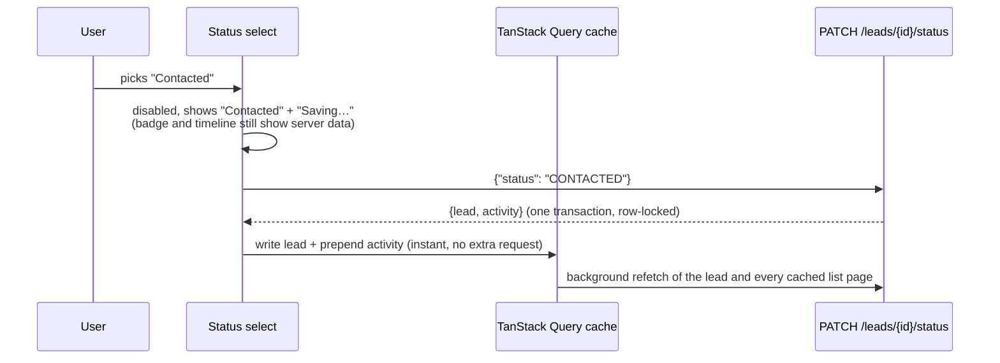
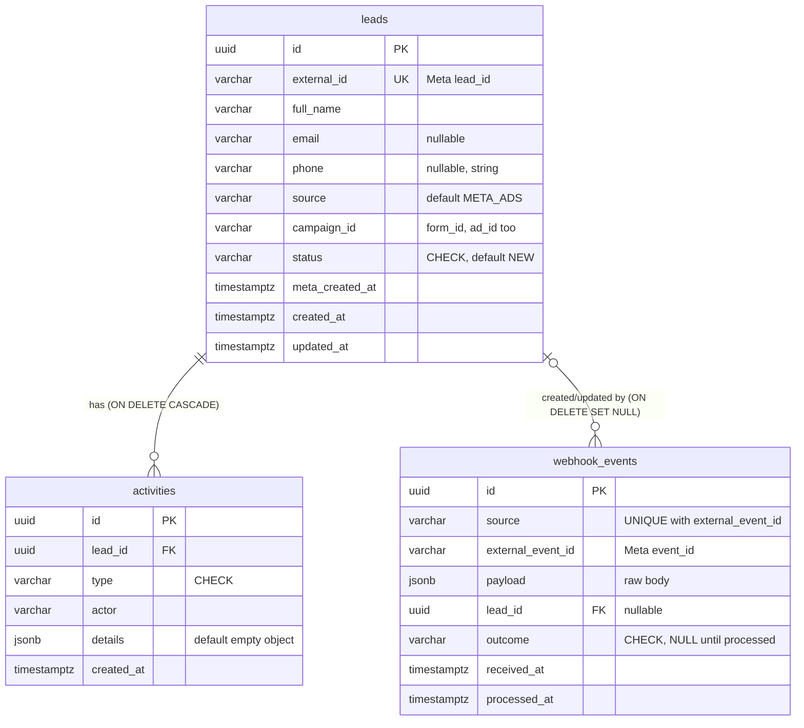
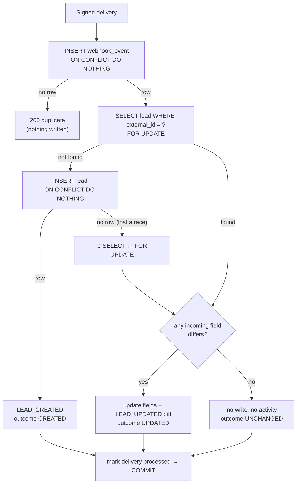

# Stylework Lead Intake Service

A lead intake service that receives Meta Ads lead webhooks, stores each lead with an append-only
audit trail in PostgreSQL, and shows them in a React dashboard where the sales team can follow a
lead's history and change its status.

It is a modular FastAPI monolith with PostgreSQL, a React + TypeScript frontend, Docker images and a
live Railway deployment. Webhooks are signature-verified and idempotent, concurrent updates are
serialized by the database, every change to a lead is audited in the same transaction, and the
behaviour is covered by 250 automated tests (170 backend against real PostgreSQL, 80 frontend).

| | |
|---|---|
| **Dashboard** | https://frontend-production-ce70.up.railway.app |
| **API docs** (OpenAPI) | https://backend-production-fa824.up.railway.app/docs |
| **Health** | https://backend-production-fa824.up.railway.app/health |
| **Repository** | https://github.com/adityamondal1311/lead-intake-service |

The live deployment holds **synthetic demo data only** and has **no authentication** (see
[Known Limitations](#known-limitations)).

### For reviewers: start here

1. Open the **dashboard**: search, filter by status, page through the leads.
2. Open a lead and read its **activity timeline** (created by the webhook, updated by a later
   webhook event, status changes).
3. **Change its status** and watch the `STATUS_CHANGED` entry appear at the top of the timeline.
4. Try the API in **`/docs`** (examples included for every endpoint).
5. Read [Architecture Decisions](#architecture-decisions) and [Trade-offs](#trade-offs), then
   [AGENT.md](AGENT.md) for how AI was used, what was decided by hand and how it was verified.
6. Run it locally with one command: [Setup Instructions](#setup-instructions).

## Contents

- [Features](#features)
- [Architecture](#architecture)
- [Tech Stack](#tech-stack)
- [Data Model](#data-model)
- [API](#api)
- [Webhook & Idempotency](#webhook--idempotency)
- [Audit Trail](#audit-trail)
- [Setup Instructions](#setup-instructions)
- [Running Tests](#running-tests)
- [Deployment Steps](#deployment-steps)
- [Architecture Decisions](#architecture-decisions)
- [Trade-offs](#trade-offs)
- [Scaling Considerations](#scaling-considerations)
- [Security](#security)
- [Observability](#observability)
- [Final Engineering Review](#final-engineering-review)
- [Known Limitations](#known-limitations)
- [Future Improvements](#future-improvements)
- [AI Usage](#ai-usage)

## Features

| Assignment requirement | Delivered |
|---|---|
| `POST /webhook/meta-lead` | Signed Meta webhook (HMAC-SHA256 on the raw body), subscription handshake, idempotent processing, safe under concurrent and repeated deliveries |
| `GET /leads` | Paginated, status-filtered, searchable lead list |
| `GET /leads/:id` | Lead with its full activity timeline |
| `PATCH /leads/:id/status` | Transactional, row-locked status change; same status is a no-op |
| Audit: Lead Created / Lead Updated / Status Changed | Append-only `activities`, written in the same transaction as the change they record; field-level diffs for updates |
| Lead List, Lead Detail View, Activity Timeline | React + TypeScript dashboard: URL-driven search/filter/pagination, readable timeline, server-authoritative status updates, responsive (table on desktop, cards on phones), accessible |
| PostgreSQL | Constraints, unique keys and row locks carry the correctness guarantees; Alembic migrations |
| Docker | Pinned, non-root images; `docker compose up --build` runs the whole app |
| Live deployment | Railway (Infrastructure as Code, release-step migrations, deploys gated on CI) |

Also: JSON structured logs with request ids and no PII, a consistent error envelope, strict
configuration validation, an idempotent demo seed that goes through the real services, and CI that
lints, tests and smoke-tests the container stack on every push.

## Architecture

```
                              ┌──────────────┐
                              │   Meta Ads   │
                              └──────┬───────┘
                                     │ signed webhook (HMAC-SHA256)
                                     ▼
┌─────────────────┐  HTTPS   ┌─────────────────┐  private network  ┌──────────────┐
│ Browser         │  + CORS  │ backend         │ ────────────────▶ │ PostgreSQL   │
│ React dashboard │ ───────▶ │ FastAPI         │   SQLAlchemy 2    │ (managed,    │
└────────▲────────┘          │ (uvicorn)       │   psycopg 3       │  no public   │
         │ static files      └─────────────────┘                   │  access)     │
┌────────┴────────┐                                                └──────────────┘
│ frontend: nginx │
└─────────────────┘
```

Three deployable units: a static frontend (nginx), one API service, one database. The browser
loads the dashboard from nginx and calls the API directly (CORS restricted to the dashboard's
origin). Meta calls the same API's webhook endpoint server to server.

**Why a modular monolith.** The domain is three tables and four endpoints. Microservices would add
deployment units, network hops and partial-failure modes without solving a current problem, and
would turn "update the lead and write its audit entry atomically" from one database transaction
into a distributed-consistency problem. Strict layering keeps the modules separable if extraction
is ever needed.

**Why no queue (yet).** A webhook delivery does a handful of indexed writes in one transaction and
answers in milliseconds, well within Meta's timeout. A queue would add infrastructure and a second
consistency boundary for no current benefit. The design keeps the path open: every accepted
delivery is already recorded in `webhook_events` with its raw payload (today in the same
transaction as its processing, so a failure rolls it back for Meta to retry); moving that insert
into its own transaction is the first step of persist → acknowledge → process-in-a-worker (see
[Scaling Considerations](#scaling-considerations)).

### Backend layering

```
routes (FastAPI)      HTTP only: validation, status codes, schema mapping
   ▼
services              business rules; own the transaction (commit / rollback)
   ▼
repositories          one place per table for queries: locking reads, ON CONFLICT inserts
   ▼
SQLAlchemy 2 (sync) + psycopg 3 → PostgreSQL
```

Services are FastAPI-free and return ORM objects; routes map them to camelCase response schemas.
Every write path (webhook, status change) is one transaction opened and committed by one service
function, so a lead change and its audit entry can never be committed separately.

### Frontend data flow

```
page → hook (useLeads / useLead / useUpdateLeadStatus) → TanStack Query → api/leads.ts → api/client.ts → fetch
```

Components never call `fetch`. The typed client turns every failure into one `ApiError` (`status`,
`code`, `message`, `requestId`; `NETWORK_ERROR` when the server is unreachable), so the UI can say
*why* something failed and show the request id that finds it in the server logs. Queries retry only
network errors and 5xx (at most twice; a 4xx fails the same way every time), and pass TanStack's
`AbortSignal` to `fetch`, so a superseded request can never overwrite newer data.

**Lead list: the URL is the state** (`/?search=kumar&status=LOST&page=2`), so views can be shared
and Back works. Invalid values are normalized in place, never sent to the API. Search is debounced
300 ms; typing *replaces* the history entry, pagination *pushes* one. While the next page loads the
current rows stay visible, dimmed. Table on desktop, cards on phones; real links, labelled inputs,
status always shown as text.

**Lead detail and timeline.** The timeline is shown in API order (newest first), each activity as a
sentence ("Lead updated: email, phone" with old → new values). `parseActivity` validates each
entry's untyped `details` before narrowing it to a typed union; an unexpected entry renders as
"Activity recorded" instead of breaking the page. "Back to leads" restores the exact filtered view;
an unknown or malformed id shows "Lead not found" without retries.

**Status changes are server-authoritative, not optimistic.** A status change is an audited domain
operation, so the UI never shows a change the server has not recorded:



On failure the select returns to the server's value and shows the reason and request id; status
changes are never retried automatically. If two people change the same lead, the backend's row lock
serializes them and the refetch shows the true sequence.

### Repository layout

```
backend/app/        api/ (routes) → services/ (transactions) → repositories/ (queries) → models/;
                    schemas/ (camelCase I/O), core/ (settings, HMAC, errors, logging), db/
backend/alembic/    migrations            backend/tests/  unit/ and integration/ (real PostgreSQL)
backend/scripts/    seed.py, send_test_webhook.py, init-test-db.sql
frontend/src/       pages/ → hooks/ → api/; components/, lib/ (URL rules, retry policy,
                    activity parsing), test/ (MSW server, stateful fake API)
frontend/nginx/     SPA fallback, caching, security headers
.railway/           Railway Infrastructure as Code (railway.ts)
.github/workflows/  CI: backend, frontend and docker jobs
docker-compose.yml  PostgreSQL + backend + frontend
```

## Tech Stack

| Layer | Choice |
|---|---|
| Backend | Python 3.12, FastAPI, Pydantic v2, uvicorn; uv (lockfile), ruff |
| Database | PostgreSQL (17.11 locally and in CI; 18.6 on Railway, standard features only), SQLAlchemy 2 (sync) + psycopg 3, Alembic |
| Frontend | React 19, TypeScript 6 (strict), Vite 8, react-router 8 (data mode), TanStack Query 5, Tailwind CSS 4 |
| Testing | pytest against real PostgreSQL; Vitest 5 + Testing Library + MSW 2 |
| Containers | Docker multi-stage images (pinned by digest, non-root), Docker Compose, nginx-unprivileged |
| CI / Deployment | GitHub Actions; Railway (Infrastructure as Code) |

## Data Model



- **`leads`**: one row per Meta lead. `external_id` (Meta's `lead_id`) is `UNIQUE`: the same lead
  can never be stored twice.
- **`activities`**: the audit trail (see [Audit Trail](#audit-trail)).
- **`webhook_events`**: one row per accepted delivery. `UNIQUE (source, external_event_id)` is the
  idempotency guard. The raw payload is kept for audit/replay and is never returned by the API or
  logged.

**Enums as VARCHAR + CHECK**, not native Postgres `ENUM`: adding a value to a native enum needs
special migration handling; a CHECK is a plain drop-and-recreate. The CHECK SQL is generated from
the Python `StrEnum`s, so code and database cannot drift. **Delete rules:** deleting a lead (e.g. an
erasure request) cascades to its activities but only nulls `webhook_events.lead_id`, so the fact
that a delivery was received survives. UUID keys, UTC `timestamptz`, phone numbers as strings.

**Indexes**, each tied to a query:

| Index | Serves |
|---|---|
| `ix_leads_status_created_at (status, created_at DESC)` | Lead list filtered by a selective status, and every status-filtered count (index-only). For a common status the planner rightly prefers walking `ix_leads_created_at` (measured, see [Final Engineering Review](#final-engineering-review)) |
| `ix_leads_created_at (created_at DESC)` | Unfiltered lead list, newest first |
| `ix_activities_lead_id_created_at (lead_id, created_at DESC)` | One lead's timeline (also covers the FK, which Postgres does not index automatically) |
| `uq_leads_external_id` | Webhook lookup of an existing lead by Meta `lead_id` |
| `uq_webhook_events_source_external_event_id` | Duplicate-delivery detection |

Deliberately not indexed yet: `webhook_events.lead_id` (no query reads deliveries by lead) and the
search columns (`ILIKE`; a `pg_trgm` GIN index is the scaling path).

## API

Interactive docs at `/docs` (the bare `/` redirects there; OpenAPI at `/openapi.json`), with
example requests and responses. JSON is camelCase.

| Method | Path | Purpose |
|---|---|---|
| `GET` | `/health` | Liveness + database check (503 if PostgreSQL is unreachable) |
| `GET` | `/leads` | Paginated, filterable, searchable lead list |
| `GET` | `/leads/{id}` | One lead with its activity timeline |
| `PATCH` | `/leads/{id}/status` | Change status; records a `STATUS_CHANGED` activity |
| `GET` | `/webhook/meta-lead` | Meta subscription handshake |
| `POST` | `/webhook/meta-lead` | Signed Meta lead ingestion (see [Webhook & Idempotency](#webhook--idempotency)) |

### `GET /leads`

| Param | Default | Rules |
|---|---|---|
| `page` | 1 | ≥ 1. A page past the end returns an empty `data` list with correct totals. |
| `limit` | 20 | 1–100 |
| `status` | – | `NEW`, `CONTACTED`, `QUALIFIED`, `CONVERTED` or `LOST` |
| `search` | – | ≤ 100 chars, trimmed. Case-insensitive substring of name, email or phone; `%` and `_` match literally. |

Ordered newest first (`created_at DESC, id DESC`; the id tie-break keeps page boundaries stable).
Response: `{"data": [lead summaries], "pagination": {"page", "limit", "total", "totalPages"}}`.

### `GET /leads/{id}`

Response: `{"lead": {…}, "activities": [{id, type, actor, details, createdAt}, …]}`, activities
newest first (shapes in [Audit Trail](#audit-trail)). The raw webhook payload is never exposed.

### `PATCH /leads/{id}/status`

Request `{"status": "CONTACTED"}` → `{"lead": {…}, "activity": {…}}`. Any status may move to any
other (sales teams reopen lost leads). Setting the status the lead already has is a **no-op**:
nothing is written and `"activity": null`, keeping the audit trail free of noise.

All in **one transaction**:

1. `SELECT … FOR UPDATE` locks the lead's row. A concurrent update of the same lead waits here, so
   the `from` value recorded next is always the status actually being replaced.
2. Same status → return without writing.
3. `UPDATE` the status and `INSERT` the `STATUS_CHANGED` activity (`{"from", "to"}`).
4. `COMMIT`. If either write fails, both roll back.

### Errors

Every non-2xx response has the same envelope:

```json
{"error": {"code": "LEAD_NOT_FOUND", "message": "Lead not found", "details": null, "requestId": "3f2a…"}}
```

| Status | Code | When |
|---|---|---|
| 422 | `VALIDATION_ERROR` | Invalid query/path/body; `details` lists `{location, field, message}` per problem. The rejected value itself is not returned, as it may be PII (a message can still quote a single offending character, e.g. for a malformed UUID) |
| 401 | `INVALID_SIGNATURE` | Webhook signature missing or wrong |
| 403 | `FORBIDDEN` | Webhook handshake with a wrong verify token |
| 404 | `LEAD_NOT_FOUND` / `NOT_FOUND` | Unknown lead id / unknown route |
| 405 | `METHOD_NOT_ALLOWED` | Wrong method (with `Allow` header) |
| 413 | `PAYLOAD_TOO_LARGE` | Webhook body over 64 KiB |
| 500 | `INTERNAL_ERROR` | Unexpected failure; the traceback is logged under the `requestId`, never returned |

`requestId` matches the `X-Request-ID` response header and every server log line for that request.

## Webhook & Idempotency

### Payload

A normalized, flat payload (snake_case, as Meta names fields):

```json
{
  "event_id": "evt_123",
  "lead_id": "meta_lead_123",
  "created_time": "2026-09-24T10:00:00+0000",
  "campaign_id": "cmp_1", "form_id": "form_1", "ad_id": "ad_1",
  "full_name": "Rahul Sharma",
  "email": "rahul@example.com",
  "phone": "+919999999999"
}
```

Required: `event_id`, `lead_id`, `full_name`, and at least one of `email` / `phone`. Values are
trimmed, the email is lowercased and format-checked, blank optional fields become null,
`created_time` must include a timezone, and unknown fields are ignored.

> **Scope note.** A real Meta Lead Ads webhook carries only a `leadgen_id` plus page/form/ad ids;
> the name, email and phone are then fetched from the Graph API with a page access token. This
> service accepts the lead *after* that enrichment step; the Graph API fetch is out of scope.

### Authenticity

Meta signs each delivery with HMAC-SHA256 over the **raw body bytes**, keyed with the app secret,
in `X-Hub-Signature-256: sha256=<hex>`. The service reads the raw body (capped at 64 KiB),
recomputes the HMAC and compares in constant time **before parsing anything**, so an
unauthenticated caller gets `401 INVALID_SIGNATURE` and nothing else. An empty `META_APP_SECRET`
rejects every delivery; production refuses to start without it. `GET /webhook/meta-lead` answers
Meta's subscription handshake: with `hub.mode=subscribe` and the right `hub.verify_token` it echoes
`hub.challenge`, otherwise 403.

### Processing: one transaction

Two separate keys, for two separate problems:

| Key | Constraint | Protects against |
|---|---|---|
| Meta `event_id` | `UNIQUE (source, external_event_id)` on `webhook_events` | The **same delivery** processed twice (Meta retries) |
| Meta `lead_id` | `UNIQUE (external_id)` on `leads` | The **same lead** stored twice (different events about one lead) |



Responses: `200 {"status": "processed", "outcome": "CREATED" | "UPDATED" | "UNCHANGED", "leadId": "…"}`
or `200 {"status": "duplicate"}` (a 2xx, so Meta stops retrying). If any step fails, everything
rolls back, **including the delivery row**, so Meta's retry is processed from a clean slate.

**Update semantics.** Fields that differ are applied and recorded as a field-level diff. A field
that is **absent or blank** in a later event never erases the stored value (events are partial
updates, not snapshots). The webhook **never changes `status`**, so a salesperson's decision is
never undone by a later Meta event.

### Why the database is the concurrency boundary

**Why not "check whether the event exists, then insert"?** Two simultaneous deliveries can both
run the check, both see nothing, and both insert. No application-level code closes that window, so
the unique constraint does: `INSERT … ON CONFLICT DO NOTHING` either inserts or reports a conflict
atomically.

- **Two identical deliveries at the same instant:** the second `INSERT` waits on the unique index
  until the first transaction ends. If the first commits, the second answers `duplicate`; if the
  first rolled back, the second inserts and processes normally, so a failed attempt never blocks
  the retry (both checked by holding an uncommitted insert open in `psql`).
- **Different events for the same new lead at the same instant:** only one lead `INSERT` succeeds;
  the other waits for its commit, gets no row back, re-reads the lead `FOR UPDATE` and continues as
  an update. Result: one lead, one `LEAD_CREATED`, the rest `LEAD_UPDATED` / `UNCHANGED`.
- **Webhook and dashboard on the same lead:** both take the same row lock, so they run one after
  the other and each audit entry's `from` value is what it actually replaced.

**Tested with real threads against real PostgreSQL**, each scenario repeated: the same event 5× at
once (1 processed, 4 duplicates, no 500s); four different events for one new lead at once (one
lead, one `LEAD_CREATED`, an unbroken `from → to` chain); a dashboard status change racing a
webhook update (both survive). Removing `ON CONFLICT` from either insert, or `FOR UPDATE` from the
webhook's lead lookup, makes these tests fail in every round.

## Audit Trail

`activities` is the lead's history. It answers "what happened to this lead, when, and who did it".

| Type | Written when | Actor | `details` |
|---|---|---|---|
| `LEAD_CREATED` | A webhook creates a new lead | `system:meta_webhook` | source, Meta event id, delivery id |
| `LEAD_UPDATED` | A later webhook event changes at least one field | `system:meta_webhook` | `{"changes": {"phone": {"from": "+911…", "to": "+912…"}}}` + event ids |
| `STATUS_CHANGED` | The dashboard changes the status | `user:dashboard` | `{"from": "NEW", "to": "CONTACTED"}` |

The guarantees:

- **Same transaction.** The lead change and its activity are written by the same service function
  and committed together. If the activity insert fails, the lead change rolls back too (tested
  with a real database failure, not a mock). A lead and its history never disagree.
- **Append-only.** No code path updates or deletes an activity; the repository exposes only `add`
  and reads.
- **No noise.** A status set to the value it already has, or a webhook event with identical data
  (`UNCHANGED`), writes no activity. The `UNCHANGED` delivery is still recorded in
  `webhook_events`: it is a delivery, not a business event.
- **Correct `from` values under concurrency.** Every read-modify-write holds the lead's row lock
  (`SELECT … FOR UPDATE`), so the recorded `from` is always the value actually replaced.
- **Correct order under concurrency.** `activities.created_at` defaults to `clock_timestamp()`
  (time of the insert, taken after the lock is held), not `now()` (transaction start). With `now()`,
  a transaction that waited on the lock often got an *earlier* timestamp than the one it waited
  for; a probe of 20 runs of four concurrent changes showed the timeline misordered in 17 of them.
  After the fix: 0 of 20.

Deleting a lead (e.g. for an erasure request) removes its activities with it; the delivery records
survive without the link.

## Setup Instructions

### Quick start: the whole app in Docker

Needs only [Docker Desktop](https://www.docker.com/products/docker-desktop/) (or Docker Engine
with Compose).

```bash
git clone https://github.com/adityamondal1311/lead-intake-service.git
cd lead-intake-service
docker compose up --build                               # db → backend → frontend, each once the previous is healthy
docker compose exec backend python -m scripts.seed      # optional: 25 demo leads with history
```

| | URL |
|---|---|
| Dashboard | http://localhost:3000 |
| API + docs | http://localhost:8000/docs |
| PostgreSQL | `localhost:5432` (user / password / db: `lead_intake`) |

Send a signed test webhook (Python 3 standard library only, nothing to install; use `python` or
`py` if that is how Python 3 is invoked on your machine):

```bash
python3 backend/scripts/send_test_webhook.py --secret change-me
```

`docker compose down -v` stops everything and deletes the data. Local secrets default to
`change-me`; override them in a root `.env` (gitignored).

### Local development (without containers for the app)

Prerequisites: Docker (for PostgreSQL), [uv](https://docs.astral.sh/uv/) (installs Python 3.12
itself), Node.js 22.22.2+ or 24.15+ (the strictest ranges among the frontend tools, from
react-router and jsdom; CI and the Docker build use Node 24).

```bash
# 1. PostgreSQL: databases lead_intake (development) and lead_intake_test (pytest only)
docker compose up -d --wait db

# 2. Backend
cd backend
cp .env.example .env                      # defaults match docker-compose.yml
uv sync
uv run alembic upgrade head
uv run uvicorn app.main:app --reload      # http://localhost:8000/docs

# 3. Frontend (another terminal)
cd frontend
npm install
npm run dev                               # http://localhost:5173
```

Recent npm versions warn that `msw`'s install script is not approved; it only copies a browser
service worker that the tests do not use, so the warning can be ignored.
If you run the compose `backend` container at the same time, stop it first
(`docker compose stop backend frontend`): it uses port 8000. The test database is created by
`backend/scripts/init-test-db.sql` when the volume is first initialised; with an older volume, run
`docker compose down -v` once.

### Demo data

```bash
cd backend
uv run python -m scripts.seed
# Seed complete: 25 created, 4 updated, 1 unchanged, 0 duplicate deliveries, 39 status changes.
```

The seed never inserts rows directly: every lead goes through the real webhook service and every
status history through the status service, so the demo is a genuine audit trail. It is idempotent
(a second run writes nothing), refuses production without `--allow-production`, and backdates
nothing (`metaCreatedAt` is spread over the preceding week).

### Sending test webhooks

```bash
cd backend
export META_APP_SECRET=change-me        # must match the server's META_APP_SECRET
uv run python scripts/send_test_webhook.py                          # new random lead
uv run python scripts/send_test_webhook.py --bad-signature          # expect 401
uv run python scripts/send_test_webhook.py --event-id evt_1 --event-id evt_1   # processed, then duplicate
# Same lead, fixed created time, new phone on the second run -> LEAD_UPDATED with a phone diff
uv run python scripts/send_test_webhook.py --lead-id L1 --email r@example.com --created-time 2026-09-24T10:00:00Z --phone +911
uv run python scripts/send_test_webhook.py --lead-id L1 --email r@example.com --created-time 2026-09-24T10:00:00Z --phone +912
```

The script signs the body itself (stdlib `hmac`), independently of the app's code. To send to the
live API, pass `--url https://backend-production-fa824.up.railway.app/webhook/meta-lead` with the
production secret, which is held only in Railway; without it the API answers `401`.

### Environment variables (backend)

| Variable | Default | Purpose |
|---|---|---|
| `ENVIRONMENT` | `local` | Exactly `local`, `test` or `production`. Anything else (e.g. `prod`) stops startup, so a typo can never skip the production checks |
| `LOG_LEVEL` | `INFO` | Exactly `DEBUG`, `INFO`, `WARNING`, `ERROR` or `CRITICAL` |
| `DATABASE_URL` | local compose DB | `postgres://` and `postgresql://` are accepted and rewritten to the psycopg 3 driver (Railway supplies the former) |
| `TEST_DATABASE_URL` | local `lead_intake_test` | Used only by pytest |
| `CORS_ORIGINS` | `["http://localhost:5173"]` | JSON list of exact origins, `scheme://host[:port]` with no path or trailing slash (browsers send `Origin` without one, so it would never match; the app refuses such values) |
| `META_APP_SECRET` | empty | HMAC key for `X-Hub-Signature-256`. Empty → every delivery rejected. **Required** in production |
| `META_VERIFY_TOKEN` | empty | Token for Meta's subscription handshake. **Required** in production |
| `RUN_MIGRATIONS_ON_START` | `true` | Container entrypoint only: `true` migrates before starting; `false` leaves it to a release step (Railway) |

Frontend: `VITE_API_BASE_URL` (default `http://localhost:8000`), compiled into the bundle at
**build** time. Every backend value is validated at startup; an invalid one stops the app with an
error naming the variable. Only `.env.example` files are committed.

## Running Tests

```bash
# Backend: needs the compose PostgreSQL running (docker compose up -d --wait db)
cd backend
uv run ruff check . && uv run ruff format --check .
uv run pytest                              # 170 tests

# Frontend: no backend needed, the API is faked at the network boundary
cd frontend
npm run lint && npm run test && npm run build   # 80 tests; build = strict tsc + Vite
```

CI runs all of this on every push, plus a `docker` job that builds both images, starts the stack
and smoke-tests it (health with the database, migrations at head, the release-step path, deep
links and CSP, a signed webhook, the seed, non-root containers).

### Backend: 170 tests against real PostgreSQL

Not SQLite: the schema is built by running the Alembic migrations (so every run also proves them),
and tables are truncated after each test.

- **Data model:** uniqueness of lead identity and of deliveries, every CHECK constraint (each enum
  value accepted, unknown values rejected), foreign keys and delete rules, database defaults,
  `alembic check` (models and migrations in sync, server defaults included), a downgrade/upgrade
  round trip.
- **API:** pagination, filtering and search edge cases, every validation error, the envelope,
  **atomicity** (a real database failure on the activity insert rolls back the status change) and
  **concurrency** (four simultaneous status changes, repeated, must yield one unbroken
  `from → to` chain in the right order).
- **Webhook:** every signature rejection case (checked against an independent HMAC), the payload
  rules, the size cap, the handshake, rollback of a failed delivery, and the concurrency scenarios
  in [Webhook & Idempotency](#webhook--idempotency).
- **Hardening:** strict configuration values; **no PII in logs** (distinctive name/email/phone
  sent through seven paths, including a database failure with traceback, and searched for in
  every captured log line); CORS, including readable request ids on error responses; the seed.

### Frontend: 80 tests with Vitest, Testing Library and MSW

The tests render the real app (routes, pages, hooks, API client) in jsdom and drive it like a user.
The API is faked with MSW at the **network boundary** rather than by mocking the client, so request
building, error mapping, the retry policy and cancellation stay under test. The fake is
**stateful** (`src/test/fakeApi.ts`): a `PATCH` changes what later `GET`s return, so flows such as
"change the status, go back, see it in the list" are tested, not scripted. Unhandled requests fail
the test.

- **Unit:** URL rules, pagination, relative times, retry policy, client error mapping, activity
  parsing.
- **Lead list:** loading/empty/error states, 5xx retried twice then shown with its request id,
  search sending **one** request after the debounce, URL-driven filters, pagination and Back.
- **Lead detail and status:** timeline and fallback, not-found with exactly one request, the badge
  still showing the **old** status while saving, the PATCH response applied **before** the
  background refetch (held back in the test), a failed PATCH sent once and reverted, another
  user's concurrent change.

### Tests proven to catch what they guard

Each key protection was deliberately removed to confirm its test fails, then restored:

| Protection removed | Test that failed |
|---|---|
| `FOR UPDATE` on the status update | status concurrency test (5/5 runs) |
| `clock_timestamp()` → `now()` | timeline-order check (3/5 rounds) |
| `ON CONFLICT` on the delivery insert / the lead insert | duplicate-delivery test / new-lead race test (every round) |
| `FOR UPDATE` on the webhook's lead lookup | new-lead race test (broken `from → to` chain) |
| `hide_parameters=True` on the engine, or query strings in the access log | no-PII-in-logs test |
| 300 ms debounce → 0 ms | one-request search test and history test |
| Retry policy changed (5xx not retried / 4xx retried) | retry tests / both not-found tests |
| Optimistic update, enabled select while saving, or PATCH response not cached | the corresponding status-flow test |

**Deliberately not covered:** browser end-to-end tests (e.g. Playwright against the real stack)
are a [future improvement](#future-improvements); no coverage percentage target and no snapshot
tests.

## Deployment Steps

Railway runs three services in one project: **Postgres** (managed, private network only),
**backend** and **frontend**, each built from **the same Dockerfile the CI `docker` job builds and
smoke-tests**. Only the frontend and backend have public HTTPS domains.

### Docker images

| Image | Size | Build | Runtime |
|---|---|---|---|
| `backend` | ~308 MB | uv installs exactly `uv.lock`, no dev dependencies | `python:3.12.14-slim` with only the virtualenv and code; non-root (uid 10001); uvicorn as PID 1 (graceful shutdown) |
| `frontend` | ~83 MB | `npm ci` from the lockfile, `tsc -b && vite build` | `nginx-unprivileged` serving only the built files; non-root (uid 101) |

Every base image is pinned by version and `sha256` digest. The backend entrypoint runs
`alembic upgrade head` (unless `RUN_MIGRATIONS_ON_START=false`) and fails the container if a
migration fails, so the API never serves an unexpected schema. nginx serves `index.html` for deep
links, caches hashed assets for a year and never caches `index.html`, gzips text, and sends
security headers and a CSP on every response. `.dockerignore` keeps `.env` files, tests and caches
out of the images.

### Infrastructure as Code

The Railway configuration is declared in [`.railway/railway.ts`](.railway/railway.ts) (Railway's
Infrastructure as Code; the older `railway.json` is deprecated and stops being read on 2026-12-01).
It is applied with the Railway CLI, not on push:

```bash
cd .railway && npm install          # the pinned railway IaC SDK
railway login && railway link       # once, interactively
railway config plan                 # review the diff against the live environment
railway config apply
```

| Setting | Why |
|---|---|
| Deploy on push to `main` with **Wait for CI** (`checkSuites`) | nothing deploys unless the backend, frontend and docker CI jobs pass |
| **Watch paths** `/backend/**`, `/frontend/**` | a frontend-only change does not redeploy the backend, and vice versa |
| Backend **pre-deploy** `alembic upgrade head`, `RUN_MIGRATIONS_ON_START=false` | migrations run once per deploy, before the new version takes traffic; a failed migration fails the deploy and the previous version keeps serving |
| Healthchecks: backend `/health` (checks PostgreSQL), frontend `/` | traffic moves only to a healthy new version |
| `ENVIRONMENT=production` | the app refuses to start without real Meta secrets |
| `DATABASE_URL=${{Postgres.DATABASE_URL}}` | private-network connection string |
| `CORS_ORIGINS=["https://${{frontend.RAILWAY_PUBLIC_DOMAIN}}"]` | only the deployed dashboard may call the API from a browser |
| `VITE_API_BASE_URL=https://${{backend.RAILWAY_PUBLIC_DOMAIN}}` (frontend) | passed as a Docker build argument and compiled into the bundle |
| `RAILWAY_DOCKERFILE_PATH=Dockerfile` | pins the Dockerfile builder |

### Deploying to a new Railway environment

1. Create the project, connect the GitHub repository, then `railway login` and `railway link`.
2. `cd .railway && npm install && railway config apply` to create the services and settings.
3. Create both public domains **before the first deploy** (`railway domain --service backend`,
   `railway domain --service frontend`): `CORS_ORIGINS` and `VITE_API_BASE_URL` reference them and
   resolve empty otherwise (the backend's origin validation then fails the release step, which is
   what happened on this project's first deploy).
4. Set the secrets directly in Railway (`META_APP_SECRET`, `META_VERIFY_TOKEN`; generate them
   locally, e.g. `python -c "import secrets; print(secrets.token_urlsafe(32))"`). They are marked
   `preserve()` in `railway.ts`, so applying the config never overwrites them.
5. Deploy (push to `main`, or `railway redeploy --service <name> --from-source`), then check
   `/health` and the dashboard.
6. Optional demo data: `railway ssh --service backend -- python -m scripts.seed --allow-production`.

**Local vs production migrations, deliberately different.** Local Docker migrates at container
start because it is a single instance, keeping `docker compose up` one command. On Railway
migrations are a release step, so schema changes happen once per deploy rather than once per
replica, and a failed migration stops the deploy before traffic moves.

Platform quirks met during setup (settings the IaC reported as applied but did not persist, a
Windows-only CLI version check) are recorded in [AGENT.md](AGENT.md#phase-12-first-railway-deploy--findings-and-fixes).

### Production Verification

Checked on the live deployment on 2026-09-26:

| Check | Result |
|---|---|
| Builds | both services built from their own Dockerfiles |
| Release step | ran `alembic upgrade head`; the database is at head; the app logged "skipping migrations at start" |
| Processes | backend uvicorn as uid 10001, nginx as uid 101 |
| Database | PostgreSQL 18.6, no public domain, no TCP proxy |
| API / frontend | `/health` ok with database; `/docs` served; dashboard and deep links served; the bundle calls the HTTPS API; CSP `connect-src` allows only that origin |
| CORS | `PATCH` preflight allowed only from the live dashboard origin; other origins and `localhost` refused |
| Status change | a `PATCH` from the live dashboard recorded `NEW → CONTACTED` on the timeline |
| Webhook | real secret → `processed`, same event → `duplicate`; wrong secret → `401`; handshake echoes the challenge for the real token, 403 otherwise |
| Seed | refused without `--allow-production`; run 1 created the demo data, run 2 wrote nothing |
| Logs | JSON, parsed by Railway into fields; zero occurrences of test lead name/email/phone |
| Watch paths | a push touching only docs and `.railway/` skipped both deployments |
| Wait for CI | enabled in the applied configuration (`railway config plan` reports no drift); a deploy visibly held back for CI has not been observed yet, because every push since then changed only docs |
| Failed release | in a throwaway environment, a deploy with a broken `DATABASE_URL` **failed in the release step** while the previous deployment kept serving `/health` 200; environment deleted afterwards |

## Architecture Decisions

The full reasoning is in [AGENT.md → Architecture Decisions](AGENT.md#architecture-decisions).

| Decision | Why |
|---|---|
| Modular monolith, routes → services → repositories | Small domain; one transaction per change; no distributed consistency to manage |
| FastAPI + PostgreSQL | Validation and OpenAPI for free; unique constraints, `ON CONFLICT`, `FOR UPDATE`, JSONB, CHECK |
| Sync SQLAlchemy | I/O-light CRUD; sync sessions keep transactions, locks and tests simple |
| Two dedup keys (`event_id`, `lead_id`) | Delivery retries and "same lead" are different problems |
| `LEAD_UPDATED` = a new event for an existing lead with changed fields | Covers the required activity without inventing an edit endpoint |
| Partial updates; webhook never changes status | Missing fields never erase data; a salesperson's decision is never overwritten |
| Database constraints as the concurrency boundary | Check-then-insert has a race window no application code can close |
| `clock_timestamp()` for activity time | Timeline order matches the real order of concurrent changes |
| Any → any status, same status = no-op | Sales teams reopen leads; no audit noise |
| Server-authoritative status UI | The UI never shows an audit event the server did not record |
| URL-driven list state | Shareable, bookmarkable views; Back works |
| MSW stateful fake API over client mocks | Tests the real client, retries and cancellation |
| Release-step migrations on Railway, at start locally | Once per deploy in production; one command locally |
| Railway IaC (`railway.ts`) | Reviewable, versioned infrastructure; `railway.json` is deprecated |

## Trade-offs

| Decision | Benefit | Cost / limitation |
|---|---|---|
| Modular monolith | Simple deployment; atomic lead + audit writes | Components cannot be scaled independently |
| Synchronous webhook processing | Simple, low latency, one transaction | Slow downstream work (e.g. a Graph API call) would block the webhook response |
| PostgreSQL constraints and row locks | Correctness under concurrency enforced in one place | Hot rows serialize; more operational weight than a document store |
| Pessimistic locking (`FOR UPDATE`) | Audit `from` values are always true | Concurrent writers to one lead wait for each other (fine: contention per lead is rare) |
| `ILIKE` search | Simple, no extra index or extension | Sequential scan; degrades on very large tables |
| Page-number pagination | Simple UX, shareable page URLs | Deep pages get slower; rows can shift between pages while data changes |
| Server-authoritative status updates | The UI never invents an audit event | Slightly slower perceived interaction than optimistic updates |
| Partial webhook updates, last delivered wins | No accidental data loss from sparse events | An older event delivered late can overwrite a newer value |
| Migrations at container start (local) | `docker compose up` is one command | Unsafe with multiple replicas (hence the release step on Railway) |
| Release-step migrations (Railway) | One migration per deploy, before traffic moves | Platform-specific configuration |
| Build-time API URL | Static frontend, no runtime config server | Changing the API origin needs a rebuild |
| No authentication | Keeps the assignment scope focused | The public demo dashboard can modify its (synthetic) data |
| Stateful MSW fake for frontend tests | Fast, deterministic flow tests of the real client | Not a substitute for browser end-to-end tests against the real backend |

## Scaling Considerations

The current design is sized for the assignment and has headroom: the list and timeline queries are
index-backed and the webhook does a few indexed writes per delivery. These are the next steps
**when measurements show the need**, not changes the current load requires.

**At ~10× traffic**

- **Multiple backend instances** behind Railway's load balancer: the API is stateless and
  migrations already run as a release step, so this is a configuration change.
- **Connection pooling** tuned per instance (SQLAlchemy pool size vs. Postgres `max_connections`).
- **`pg_trgm` GIN index** for search, replacing sequential `ILIKE` scans.
- **Rate limiting** on the public API (and a body/request budget on the webhook).

**At ~100× traffic**

- **Queue-based ingestion:** persist the delivery, acknowledge Meta immediately, process in workers
  (Postgres-backed queue first, a broker only if needed). This is also required once the real Graph
  API enrichment call is added, so a slow Meta API never delays the acknowledgement.
- **PgBouncer** in front of Postgres as instances multiply.
- **Read replicas** for the list and detail reads; writes stay on the primary.
- **Cursor (keyset) pagination** on `(created_at, id)`, which the existing index already supports.
- **Partition `activities` by time** once it dominates storage; the timeline index stays per lead.
- **Transactional outbox** if other systems need lead events (CRM sync, notifications), so events
  are published exactly when the lead change commits.
- **Event ordering:** use a source event version or timestamp to reject stale updates.

Microservices are not on this list: the scaling pressure is on ingestion and reads, which the steps
above address inside the same service boundaries.

## Security

- **Webhook authenticity:** HMAC-SHA256 over the raw request bytes, constant-time comparison,
  checked before the body is parsed; 64 KiB body cap; the app refuses to start in production
  without the secret and verify token.
- **Secrets:** never in the repository or images (`.env` gitignored and `.dockerignore`d; only
  `.env.example` committed). Production secrets were generated locally and set directly in
  Railway; `railway.ts` marks them `preserve()`.
- **No PII in logs:** request bodies and query strings are never logged, SQL parameters are hidden
  from database error messages (`hide_parameters=True`), validation errors do not echo input;
  proven by an automated test that fails when any of these protections is removed.
- **Browser boundary:** CORS allows only the dashboard's exact origin, the methods and headers it
  uses; nginx sends a CSP (`connect-src` limited to the API origin, `frame-ancestors 'none'`),
  `X-Frame-Options: DENY`, `nosniff` and a referrer policy.
- **Infrastructure:** non-root containers, pinned base images, PostgreSQL on Railway's private
  network only (no public domain or TCP proxy).
- **Input validation:** every request is validated by Pydantic; user search terms are escaped for
  `ILIKE`; all SQL is parameterized.
- **Known gap: no authentication or authorization** on the dashboard or its API. The upgrade path
  is SSO (or an API key) in front of the dashboard API and per-user actors in the audit trail. See
  [Known Limitations](#known-limitations).

## Observability

- **JSON logs**, one object per line on stdout; Railway parses them into searchable fields.
  Alembic's migration output uses the same format.
- **Request ids:** every request gets an `X-Request-ID` (a well-formed caller-supplied one is
  reused). It is returned in the response header and in every error body, attached to every log
  line for that request, and shown in the dashboard next to any error, so a user-reported failure
  leads straight to its server log lines.
- **Access log:** one line per request with method, path, status and duration.
- **Webhook logs** carry the event id, outcome and lead id, never lead data.
- **Health:** `/health` checks the database (with a 5 s connect timeout) and drives the container
  and Railway healthchecks.

## Final Engineering Review

A final review before submission, on 2026-09-26, checked that what this README claims is
reproducible from a clean clone and holds in code and in production. Details are in
[AGENT.md](AGENT.md#phase-14-final-engineering-review).

| Check | Result |
|---|---|
| Fresh clone, Docker quick start | Passed: `git clone` into an empty folder, images built without cache, stack healthy in 20 s; dashboard, `/docs`, seed, signed webhook, bad signature (401) and duplicate event all as documented |
| Fresh clone, local development | Passed: new virtualenv and `node_modules`; ruff clean, 170 backend tests, oxlint clean, 80 frontend tests, strict build |
| Secret history scan | Passed: all commits searched for the real production secrets and database password (0 occurrences) and for common secret patterns (only test placeholders); no `.env` file ever committed |
| Dependency audits | `npm audit` (frontend, `.railway`): 0 vulnerabilities; `pip-audit` on the locked Python dependencies (runtime and dev): no known vulnerabilities. This means none were known to the advisory databases on that date |
| Security boundaries (live) | Passed: HTTP → HTTPS, CSP and security headers, CORS limited to the dashboard origin, error envelopes without stack traces, webhook signature and handshake, no test lead data in the live logs |
| Claims vs code | Passed: same-transaction audit writes, append-only activities, row locks, constant-time HMAC, production secret check, parameterized SQL, webhook never writing status |
| Query plans at 100k leads / 300k activities (local) | Unfiltered list, timeline and webhook lookup use their indexes (< 0.2 ms); a status filter uses the status index when the status is selective (0.13 ms) and the `created_at` index when it is common, which is cheaper; counts are index-only scans (~10 ms unfiltered); search is a sequential filter (~90 ms), the documented `ILIKE` limitation |
| Query plans (production) | 27 leads, so sequential scans are correctly preferred; with sequential scans disabled every query uses its intended index |
| Manual walkthrough (live, desktop and phone) | Passed: search, status filter, pagination and Back, lead detail and timeline, status change ("Saving…", then the new activity), Back to the same filtered view; status change under a throttled "Slow 3G" network at 375 px (requested value shown disabled while the badge and timeline keep the server state); phone cards without horizontal scrolling, detail layout, status change |

Documentation corrected by the review: `python3` in the quick start, the Node.js minimum, an npm
warning explained, the status index description, and two statements made more precise (validation
messages, when deliveries are recorded). No application changes were required.

## Known Limitations

- **No dashboard/API authentication.** Anyone with the live URL can change a lead's status;
  acceptable only because the live data is synthetic.
- **Meta Graph API enrichment is simulated.** The webhook accepts the post-enrichment payload.
- **Out-of-order webhook events: last delivered wins.** The payload carries no event version or
  timestamp (`created_time` is the lead's submission time), so there is nothing reliable to compare.
- **Synchronous webhook processing**, no queue.
- **`ILIKE` search** without an index.
- **No strict status state machine**: any status may move to any other.
- **No browser end-to-end tests.**
- **Frontend API URL fixed at build time.**
- **Actor is `user:dashboard`** for every status change, since there are no user accounts.

## Future Improvements

**Priority 1: needed before real use**

1. Authentication and authorization (SSO for the dashboard, roles), with the real user recorded as
   the activity actor.
2. Meta Graph API enrichment: accept Meta's real `leadgen` webhook and fetch the lead's fields,
   done in a worker so the acknowledgement stays fast.
3. Out-of-order handling: compare a source event version/timestamp before applying updates.

**Priority 2: operational robustness**

4. Queue-based ingestion (persist → acknowledge → worker) with retries and a dead-letter view.
5. Rate limiting on the public API.
6. Playwright end-to-end tests against the composed stack in CI.
7. `railway config plan` in CI to detect drift between `railway.ts` and the live environment.

**Priority 3: scale and flexibility**

8. `pg_trgm` search index; cursor pagination.
9. Read replicas and activity partitioning when volume demands it.
10. Runtime frontend configuration (API origin without a rebuild).
11. A status transition policy, if the sales process calls for one.

## AI Usage

AI tools (ChatGPT for early brainstorming, Claude for plan review, Claude Code for implementation
and verification) were used throughout. The architecture decisions, correctness definitions, test
strategy and scope were decided by me, and every AI-generated change was reviewed and verified
(lint, tests, manual checks against real PostgreSQL and the live deployment) before being
committed. [AGENT.md](AGENT.md) records the tools, the important prompts, what was AI-generated,
what was decided by hand, and a per-phase log of what was caught and corrected.
