# Stylework Lead Intake Service

Receives Meta Ads leads via webhook, stores them with an append-only audit trail, and displays them
in a React dashboard.

> **Work in progress.** Full architecture, deployment, trade-offs and scaling documentation will be
> added as the build progresses. Design decisions and AI usage are recorded in [AGENT.md](AGENT.md).

## Stack

| Layer | Choice |
|---|---|
| Backend | Python 3.12, FastAPI, Pydantic v2 (uv for packaging) |
| Database | PostgreSQL 17, SQLAlchemy 2.x (sync) + psycopg 3, Alembic migrations |
| Frontend | React + TypeScript (Vite) |
| Deployment | Docker, Railway *(upcoming)* |
| CI | GitHub Actions: ruff + pytest against a Postgres service (backend), oxlint + type-check + build (frontend) |

## Repository layout

```
backend/
  app/
    api/          routes and dependencies (per-request DB session)
    core/         settings, JSON logging, request-ID middleware
    db/           engine/session factory, declarative Base
    models/       SQLAlchemy models: leads, activities, webhook_events
    schemas/      Pydantic response models
  alembic/        database migrations
  scripts/        init-test-db.sql (creates the test database in local Postgres)
  tests/
    unit/         no database needed
    integration/  run against real PostgreSQL
frontend/         React + TypeScript dashboard (Vite)
docker-compose.yml  local PostgreSQL
.github/          CI workflow
AGENT.md          AI usage, architecture decisions, contribution log
```

## Data model

```mermaid
erDiagram
    leads ||--o{ activities : "has (ON DELETE CASCADE)"
    leads |o--o{ webhook_events : "created/updated by (ON DELETE SET NULL)"
    leads {
        uuid id PK
        varchar external_id UK "Meta lead_id"
        varchar full_name
        varchar email "nullable"
        varchar phone "nullable, string"
        varchar source "default META_ADS"
        varchar campaign_id "form_id, ad_id too"
        varchar status "CHECK, default NEW"
        timestamptz meta_created_at
        timestamptz created_at
        timestamptz updated_at
    }
    activities {
        uuid id PK
        uuid lead_id FK
        varchar type "CHECK"
        varchar actor
        jsonb details "default empty object"
        timestamptz created_at
    }
    webhook_events {
        uuid id PK
        varchar source "UNIQUE with external_event_id"
        varchar external_event_id "Meta event_id"
        jsonb payload "raw body"
        uuid lead_id FK "nullable"
        varchar outcome "CHECK, NULL until processed"
        timestamptz received_at
        timestamptz processed_at
    }
```



- **`leads`**: one row per Meta lead. `external_id` (Meta's `lead_id`) is `UNIQUE`: it is the
  lead's identity, so the same lead can never be stored twice.
- **`activities`**: the audit trail (`LEAD_CREATED`, `LEAD_UPDATED`, `STATUS_CHANGED`), append-only:
  no code path updates or deletes an activity. `details` holds type-specific JSON (status
  from/to, field-level diff, webhook event ids); `actor` records who caused it.
- **`webhook_events`**: one row per accepted delivery. `UNIQUE (source, external_event_id)` is the
  idempotency guard: a redelivered event cannot be inserted twice, even when two deliveries race.
  The raw payload is kept for audit/replay and is never returned by the API or logged.

**Enums as VARCHAR + CHECK**, not native Postgres `ENUM`: adding a value to a native enum needs
special migration handling; a CHECK is a plain drop-and-recreate. The CHECK SQL is generated from
the Python `StrEnum`s, so code and database cannot drift.

**Delete rules:** deleting a lead (e.g. an erasure request) cascades to its activities, which mean
nothing without it, but only nulls `webhook_events.lead_id`, so the fact that a delivery was received
survives.

**Indexes**, each tied to a query:

| Index | Serves |
|---|---|
| `ix_leads_status_created_at (status, created_at DESC)` | Lead list filtered by status, newest first |
| `ix_leads_created_at (created_at DESC)` | Unfiltered lead list, newest first |
| `ix_activities_lead_id_created_at (lead_id, created_at DESC)` | Activity timeline of one lead (also covers the FK, which Postgres does not index automatically) |
| `uq_leads_external_id` | Webhook lookup of an existing lead by Meta `lead_id` |
| `uq_webhook_events_source_external_event_id` | Duplicate-delivery detection |

Deliberately not indexed yet: `webhook_events.lead_id` (no query reads deliveries by lead) and the
lead search columns. Search uses `ILIKE` on name/email/phone, fine at this scale; a `pg_trgm` GIN
index is the scaling path.

Constraint and index names follow a naming convention set on the SQLAlchemy `MetaData`, so
migrations can reference them predictably.

## API

Interactive docs: `http://localhost:8000/docs` (OpenAPI at `/openapi.json`). JSON is camelCase.

| Method | Path | Purpose |
|---|---|---|
| `GET` | `/health` | Liveness + database check (503 if Postgres is unreachable) |
| `GET` | `/leads` | Paginated, filterable, searchable lead list |
| `GET` | `/leads/{id}` | One lead with its activity timeline |
| `PATCH` | `/leads/{id}/status` | Change status; records a `STATUS_CHANGED` activity |
| `POST` | `/webhook/meta-lead` | Meta lead ingestion *(webhook phase)* |

### `GET /leads`

| Param | Default | Rules |
|---|---|---|
| `page` | 1 | ≥ 1. A page past the end returns an empty `data` list with correct totals. |
| `limit` | 20 | 1–100 |
| `status` | – | `NEW`, `CONTACTED`, `QUALIFIED`, `CONVERTED` or `LOST` |
| `search` | – | ≤ 100 chars, trimmed. Case-insensitive substring of name, email or phone; `%` and `_` match literally. |

Ordered newest first (`created_at DESC, id DESC`; the id tie-break keeps page boundaries stable).

```json
{
  "data": [
    {"id": "…", "fullName": "Rahul Sharma", "email": "rahul@example.com", "phone": "+919999999999",
     "status": "NEW", "source": "META_ADS", "campaignId": "cmp_1", "createdAt": "2026-09-25T10:00:00Z"}
  ],
  "pagination": {"page": 1, "limit": 20, "total": 1, "totalPages": 1}
}
```

### `GET /leads/{id}`

```json
{
  "lead": {"id": "…", "externalId": "meta_lead_123", "fullName": "Rahul Sharma", "…": "…",
           "formId": "form_1", "adId": "ad_1", "metaCreatedAt": "…", "updatedAt": "…"},
  "activities": [
    {"id": "…", "type": "STATUS_CHANGED", "actor": "user:dashboard",
     "details": {"from": "NEW", "to": "CONTACTED"}, "createdAt": "…"},
    {"id": "…", "type": "LEAD_CREATED", "actor": "system:meta_webhook", "details": {"…": "…"}, "createdAt": "…"}
  ]
}
```

Activities are newest first. The raw webhook payload is never exposed.

### `PATCH /leads/{id}/status`

Request `{"status": "CONTACTED"}` → `{"lead": {…}, "activity": {…}}`. Any status may move to any
other. Setting the status the lead already has is a **no-op**: nothing is written and
`"activity": null`, keeping the audit trail free of noise.

How it stays consistent, all in **one transaction**:

1. `SELECT … FOR UPDATE` locks the lead's row. A concurrent update of the same lead waits here, so
   the `from` value recorded next is always the status actually being replaced.
2. Same status → return without writing.
3. `UPDATE` the status and `INSERT` the `STATUS_CHANGED` activity (`{"from", "to"}`).
4. `COMMIT`. If either write fails, both roll back: a lead and its audit trail never disagree.

Activity timestamps use `clock_timestamp()` (time of insert, after the lock is held) rather than
`now()` (transaction start), so the timeline shows concurrent changes in the order they happened.

### Errors

Every non-2xx response has the same envelope:

```json
{"error": {"code": "LEAD_NOT_FOUND", "message": "Lead not found", "details": null, "requestId": "3f2a…"}}
```

| Status | Code | When |
|---|---|---|
| 422 | `VALIDATION_ERROR` | Invalid query/path/body; `details` lists `{location, field, message}` per problem (the rejected value is not echoed) |
| 404 | `LEAD_NOT_FOUND` | Unknown lead id |
| 404 | `NOT_FOUND` | Unknown route |
| 405 | `METHOD_NOT_ALLOWED` | Wrong method (with `Allow` header) |
| 500 | `INTERNAL_ERROR` | Unexpected failure; traceback is logged under the `requestId`, never returned |

`requestId` matches the `X-Request-ID` response header and the server log lines for that request.

## Local development

### Prerequisites

- [Docker Desktop](https://www.docker.com/products/docker-desktop/) (runs PostgreSQL locally)
- [uv](https://docs.astral.sh/uv/) (installs Python 3.12 automatically)
- Node.js 20.19+ (CI uses Node 24)

### 1. Start PostgreSQL

```bash
docker compose up -d --wait db
```

This starts Postgres 17 on `localhost:5432` with two databases: `lead_intake` (development) and
`lead_intake_test` (used only by pytest, so test runs never touch development data). The test
database is created by `backend/scripts/init-test-db.sql` the first time the volume is initialised;
if you created the volume before that script existed, run `docker compose down -v` once.

### 2. Backend

```bash
cd backend
cp .env.example .env                      # defaults match docker-compose.yml
uv sync
uv run alembic upgrade head               # apply migrations
uv run uvicorn app.main:app --reload      # http://localhost:8000/health, /docs
```

`GET /health` returns `{"status":"ok","database":"ok"}`, or **503** with `"database":"error"` if
Postgres is unreachable (connections time out after 5 s rather than hanging).

### 3. Frontend

```bash
cd frontend
npm install
npm run dev                               # http://localhost:5173
```

## Environment variables (backend)

| Variable | Default | Purpose |
|---|---|---|
| `ENVIRONMENT` | `local` | `local` / `production` |
| `LOG_LEVEL` | `INFO` | Root log level |
| `CORS_ORIGINS` | `["http://localhost:5173"]` | JSON list of allowed browser origins |
| `DATABASE_URL` | local compose DB | `postgres://` and `postgresql://` are accepted and rewritten to the psycopg 3 driver (Railway supplies the former) |
| `TEST_DATABASE_URL` | local `lead_intake_test` | Used only by pytest |
| `META_APP_SECRET` | empty | Verifies the webhook `X-Hub-Signature-256` HMAC *(used from the webhook phase)* |
| `META_VERIFY_TOKEN` | empty | Meta subscription handshake token *(used from the webhook phase)* |

Only `.env.example` is committed; `.env` is gitignored.

## Running tests and checks

```bash
# Backend (needs the compose Postgres running)
cd backend
uv run ruff check . && uv run ruff format --check .
uv run pytest

# Frontend
cd frontend
npm run lint && npm run build
```

Integration tests run against **real PostgreSQL**, not SQLite: the schema is built by running the
Alembic migrations once per test session (so every run also proves the migrations apply), and every
table is truncated after each test. CI does the same with a Postgres 17 service container.

The data model tests prove the guarantees live in the database itself (so they hold under races
and for writes that bypass the ORM): uniqueness of lead identity and of webhook deliveries, CHECK
constraints for every enum (each enum value accepted, unknown values rejected), foreign keys and
delete rules, database-side defaults, models/migrations staying in sync (`alembic check`), and a
full downgrade/upgrade round trip.

The API tests cover pagination, filtering and search edge cases, every validation error, and the
two properties the status update exists for: **atomicity** (a real database failure on the
activity insert rolls back the status change) and **concurrency** (four simultaneous changes to
one lead, repeated 5×, must yield one unbroken `from → to` chain shown in the right order). Both
tests were confirmed to fail when the row lock or the timestamp fix is removed.

## Observability

- Logs are one JSON object per line on stdout (easy to filter in Railway or any log pipeline).
- Every request gets an `X-Request-ID`: a caller-supplied one is reused if it is well-formed,
  otherwise one is generated. It is returned in the response header and attached to every log line
  written while handling that request.
- One access log line per request: method, path, status, duration. Request bodies and query strings
  are never logged, because they carry PII (lead contact details, search terms).

## Progress

- [x] Phase 0: requirements frozen, ambiguities resolved (see AGENT.md)
- [x] Phase 1: backend and frontend skeletons, CI
- [x] Phase 2: PostgreSQL via Docker Compose, SQLAlchemy, Alembic, DB-aware health check, JSON
      logging, request IDs, tests against real Postgres in CI
- [x] Phase 3: `leads`, `activities`, `webhook_events` models, first migration (constraints,
      indexes), database-level constraint tests
- [x] Phase 4: lead APIs: list (pagination, filter, search), detail with timeline, transactional
      row-locked status updates, JSON error envelope, API integration tests
- [ ] Phase 5+: webhook, frontend, Docker, deployment
